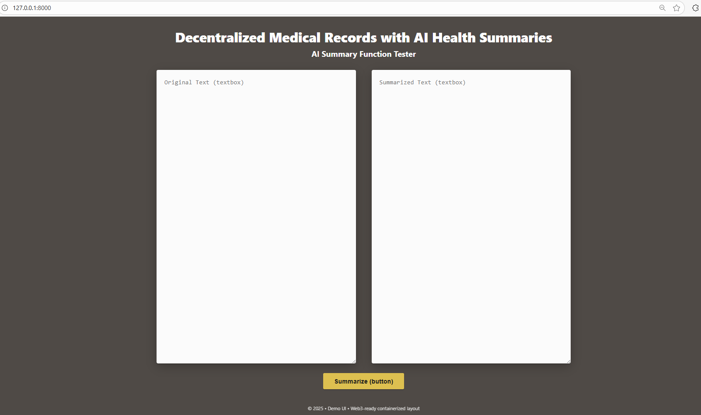

# Decentralized Medical Records with AI Health Summaries

This repository is for our CS-4800 Software Engineering project (AI Team). The AI Summary Service automatically reads medical notes or lab reports and produces short, easy-to-read summaries. It supports doctors and patients by highlighting key information and potential risks while ensuring privacy and security.

## Team Members
- Tina Arezoomanians  
- Kelly Lwin  
- Daniel Herrera  
- Javier Perez  
- Jennifer Perdomo

## Testing the Application

- Clone the repo: `https://github.com/tinaarezoomanian/CS-4800-Software-Engineering-Project---AI.git`.
- Create and activate a virtual environment, then run `pip install -r requirements.txt`.
- From the project root, start the server with `uvicorn application.app:app --reload`
- Open `http://127.0.0.1:8000` to test the app.

## TODO: Implement summarize function (application/summarize.py)

- File: `application/summarize.py`  

## Usage

1. API receives medical text.
2. AI processes text → summary + risk alert.
3. Backend stores result off-chain.